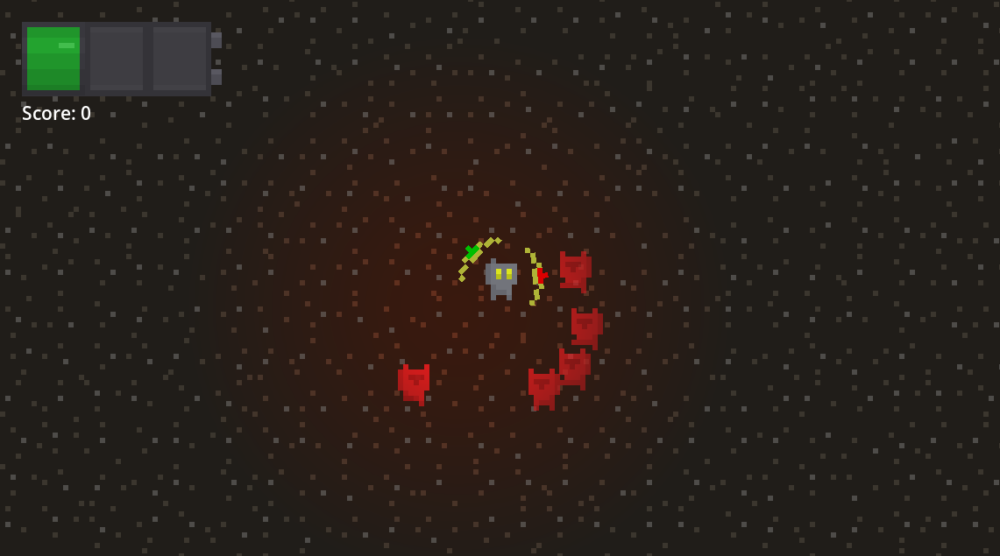
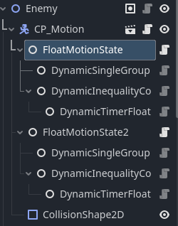
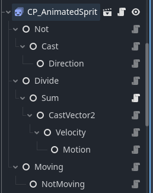

# Siege Week 3 -> Name TBD
The game I'm making for Hackclub's Siege Week 3; The theme this week was Signal.

An arcade game where you collect transmitters in the dark while dodging evil robots; made in Godot with a composition framework I've been working on.

## Devlogs
### Monday -> Setup
- Imported the framework, got rid of all the unnecessary fluff.
- Planned out what I want to make, for the most part - I'm taking this week a lot less seriously because I'm doing Milkyway too.
### Tuesday -> Basic Game Mechanics
- Got a lot done this week, namely the base game mechanics are mostly done;
    - Transmitters can be picked up and tracked
    - Enemies can attack you and be tracked
- The spawners for enemies/transmitters are... in their beginning stages
- There's no lose condition yet, or UI for that matter.
### Wednesday -> Spawners
- I got the spawners working as I want them, and not much else...
    - They spawn within the box (about 2000px each direction) every 5 seconds for transmitters, and 10 seconds for enemies.
### Thurday -> MVP
- The UI is done, just a basic start screen and lose screen.
- Losing is done, it's literally just running the losescreen animation when the health hits zero
- I've got the shader set up, though I'm definitely going to play with the effect a bit
    - Can't decide whether to do full grayscale, some lerp between color and grayscale, or what...
- I changed how the Enemies follow the player to be a big dash, then they slide along in that direction for a bit.
- 
### Friday -> Art & Submission!
- Made all the art and animation for the player, transmitter, enemy, tilesets, etc
    - Namely, I wired up all the conditions for making each animation happen, and made the speed change slightly based on velocity for enemies and the player 
    - 
- Styled up the UI
- Added a HUD to show the player's health and the current score
- Did some general cleaning up;
    - Made the UI animations a bit smoother, though you can barely tell.
    - Definitely some other stuff I'm forgetting...